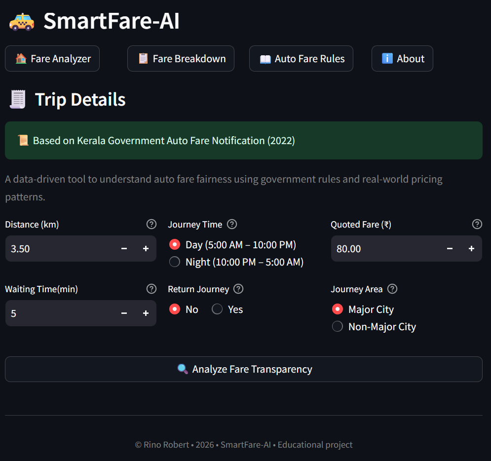
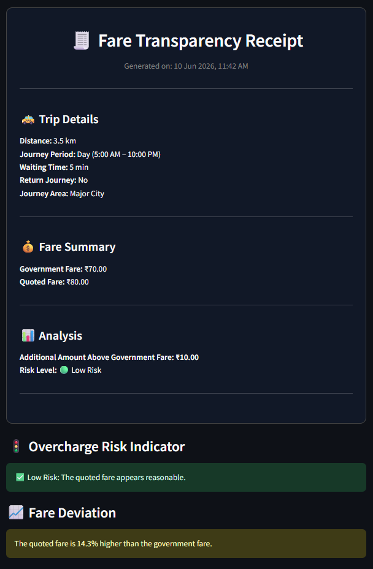
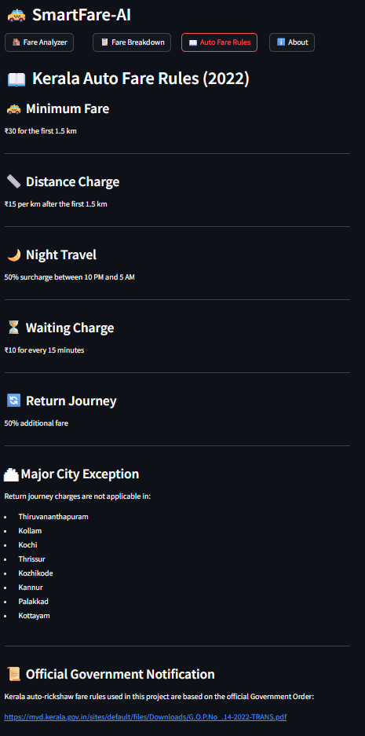

# 🚕 SmartFare-AI

### AI-Powered Fare Transparency Platform for Kerala Auto-Rickshaws

SmartFare-AI is a full-stack machine learning application that helps passengers evaluate the fairness of auto-rickshaw fares using Kerala Government fare regulations and AI-based fare estimation.

The system combines a rule-based fare engine with machine learning predictions to generate fare transparency reports, fare breakdowns, and overcharge risk assessments through an interactive web application.

---

## 🌟 Project Highlights

- Built an end-to-end AI-powered fare transparency platform
- Implemented Kerala Government fare calculation rules
- Developed an ML-based fare estimation model using Scikit-learn
- Designed REST APIs using FastAPI
- Created an interactive Streamlit dashboard
- Deployed frontend and backend on cloud infrastructure

---

## Motivation

The idea for this project came from my own experiences using auto-rickshaws across Kerala, where it was often difficult to determine whether a quoted fare was reasonable, even though government fare rules exist.

This repeated uncertainty inspired me to build a transparent fare analysis system that could instantly show:

- The government-expected fare
- A typical real-world fare estimate
- Whether a quoted fare appears reasonable

The goal is to make fare information more accessible and understandable for everyday commuters.

---

## ✨ Key Features

* Government Fare Calculation Engine
* AI-Based Fare Estimation
* Fare Transparency Reports
* Overcharge Risk Assessment
* Waiting Time & Return Journey Support
* Major City Fare Rule Handling
* Interactive Fare Breakdown Dashboard
* Kerala Fare Rules Reference
* FastAPI Backend + Streamlit Frontend

---

## 🛠️ Tech Stack

| Layer            | Technology                        |
| ---------------- | --------------------------------- |
| Frontend         | Streamlit                         |
| Backend          | FastAPI                           |
| Machine Learning | Scikit-learn                      |
| Data Processing  | Pandas, NumPy                     |
| Deployment       | Streamlit Community Cloud, Render |
| Language         | Python 3.11                       |

---

## 🏗️ Architecture

```text
User
 ↓
Streamlit Frontend
 ↓
FastAPI Backend
 ↓
Fare Rule Engine + ML Model
 ↓
Fare Transparency Report
```

---

## 💡 Skills Demonstrated

* Machine Learning
* Data Analysis
* Feature Engineering
* REST API Development
* Backend Engineering
* Frontend Development
* Cloud Deployment
* Rule-Based Systems
* UI/UX Design

---

## 🌍 Live Demo

**Frontend:** https://smartfare-ai-mqpgtrah6ub96c2h3dugsc.streamlit.app/

**Backend API Docs:** https://smartfare-ai-backend.onrender.com/docs

> Note: The project currently uses free-tier cloud hosting. Initial loading may take a few seconds after periods of inactivity.

---

## 📚 Documentation

### Test Cases

The application was validated using multiple functional test scenarios covering day/night travel, waiting charges, return journeys, major city exceptions, invalid inputs, and fare transparency workflows.

📄 Test Cases: [View Test Cases](docs/test_cases.md)

### Application Screenshots

---

#### 1. Fare Analyzer



---

#### 2. Fare Transparency Report



---

#### 3. Fare Breakdown


---

#### 4. Kerala Fare Rules



---

## ▶️ Run Locally

### Start Backend

```bash
uvicorn api.main:app --reload
```

### Start Frontend

```bash
streamlit run frontend/app.py
```

---

## 👨‍💻 About Me

**Rino Robert**

B.Tech – Artificial Intelligence & Data Science

📧 [rinorobert710@gmail.com](mailto:rinorobert710@gmail.com)

🔗 LinkedIn: https://www.linkedin.com/in/rino-robert/

🔗 GitHub: https://github.com/rinorobert