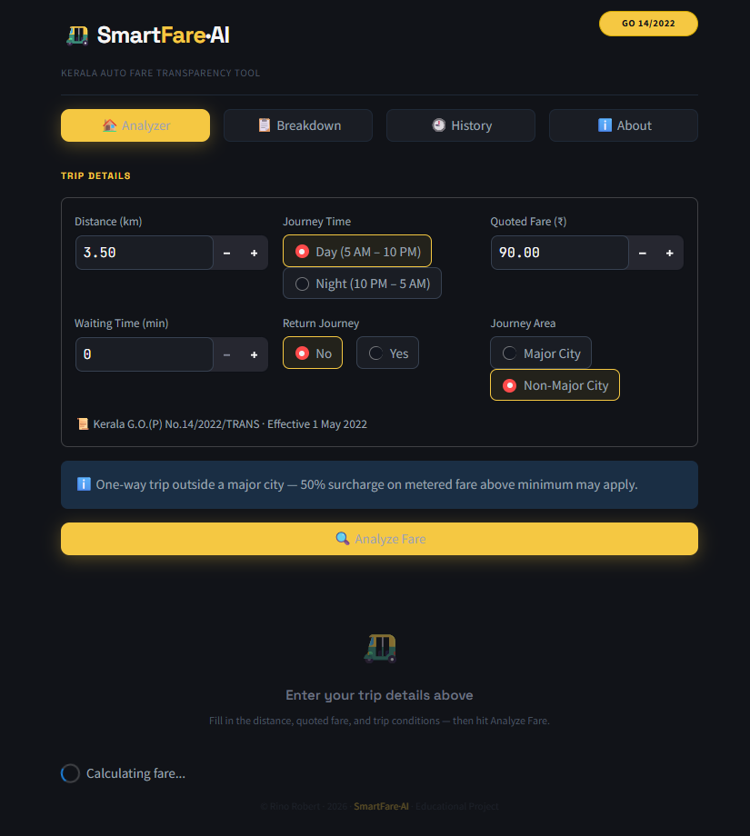
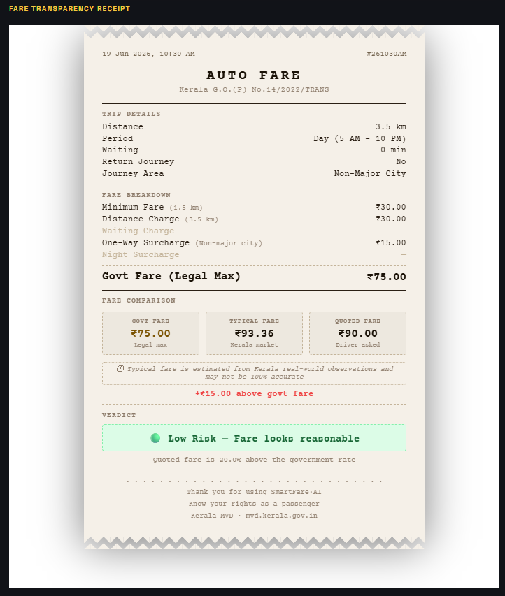
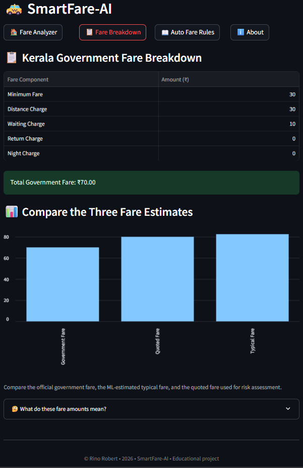
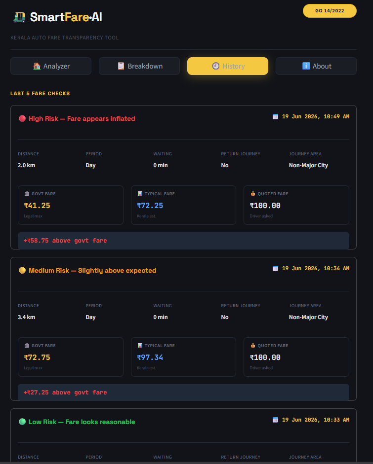
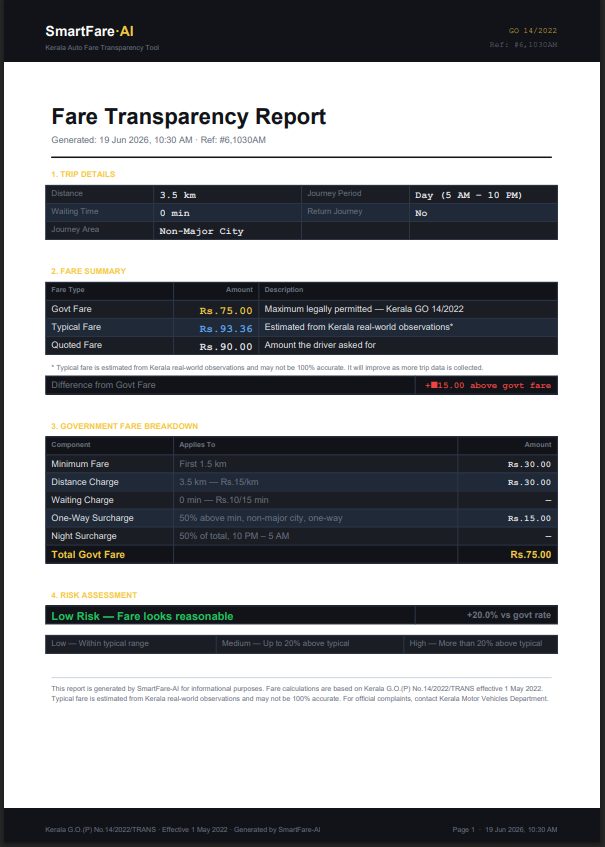

# 🚕 SmartFare-AI

### AI-Powered Fare Transparency Platform for Kerala Auto-Rickshaws




> Full-stack AI-powered fare transparency platform for Kerala auto-rickshaw passengers using FastAPI, Streamlit, and Scikit-learn.

---

## 📖 Overview

SmartFare-AI is a full-stack machine learning application that helps passengers evaluate whether an auto-rickshaw fare is fair based on Kerala Government fare regulations and real-world fare estimation.

The platform combines a rule-based fare engine with machine learning to compare government-approved fares, estimated market fares, and driver-quoted fares, helping users identify potential overcharging.

---

## 🎯 Why This Project Matters

Auto-rickshaw fares in Kerala are regulated, yet passengers often lack an easy way to verify quoted fares. SmartFare-AI bridges this gap by combining government fare rules with machine learning-based fare estimation.

SmartFare-AI addresses this by:

- Computing the **exact government-permitted fare** from the official rules, broken down component by component
- Estimating a **typical real-world fare** based on actual observations, to give a practical market reference point
- Generating a **timestamped fare transparency receipt** the passenger can reference or share
- Producing a **downloadable PDF report** with a full fare audit trail

The project is grounded in a real-world problem, uses real government regulations as its data source, and produces output a non-technical user can act on.

---

## 📌 Project Highlights

✅ Full-Stack AI Application

✅ Kerala Government Fare Rule Engine

✅ Machine Learning Fare Prediction

✅ FastAPI REST API Backend

✅ Interactive Streamlit Dashboard

✅ Thermal Receipt-Style Reporting

✅ PDF Fare Audit Reports

✅ Cloud Deployment (Render + Streamlit)

---

## 🚀 Features

* Government fare calculation based on Kerala auto-rickshaw regulations.
* ML-powered fare estimation using Scikit-learn.
* Overcharge risk assessment (Low, Medium, High).
* Detailed fare transparency report.
* Thermal receipt-style fare summary.
* Downloadable PDF fare audit report.
* WhatsApp-shareable fare summary.
* Trip history tracking.
* Interactive and responsive dashboard.

---

## 🛠️ Tech Stack

### Frontend

* Streamlit
* HTML/CSS Components

### Backend

* FastAPI
* Uvicorn

### Machine Learning

* Scikit-learn
* Pandas
* NumPy
* Joblib

### Reporting

* ReportLab

### Deployment

* Streamlit Community Cloud
* Render

---

## 🏗️ System Architecture

```text
User
  ↓
Streamlit Frontend
  ↓
FastAPI Backend
  ↓
Rule-Based Fare Engine + ML Model
  ↓
Fare Analysis & Risk Assessment
```

---

## 🤖 Machine Learning Approach

* Developed a synthetic Kerala auto-fare dataset based on real-world observations and Kerala fare regulations.
* Engineered features such as distance, journey period, and fare components.
* Trained and evaluated Ridge Regression and Gradient Boosting models.
* Selected the best-performing model using Mean Absolute Error (MAE).
* Integrated the trained model into the FastAPI backend for real-time fare prediction.
* Implemented a rule-based fallback mechanism to ensure uninterrupted predictions.

---

## 📸 Application Screenshots

### Dashboard


*Interactive fare analyzer for entering trip details and evaluating quoted fares.*

---

### Fare Transparency Receipt



*Thermal receipt-style report showing government fare, ML-estimated fare, quoted fare, and risk assessment.*

---

### Government Fare Breakdown



*Detailed fare calculation based on Kerala Government fare regulations.*

---

### Trip History



*Stores and displays the last five fare analyses with complete trip details and risk classifications.*

---

### PDF Report Export



*Professional downloadable fare audit report generated using ReportLab.*

---

## 📂 Project Structure

```text
SmartFare-AI/
├── api/
│   ├── main.py
│   └── model/
├── assets/
│   ├── dashboard.png
│   ├── receipt.png
│   ├── breakdown.png
│   ├── history.png
│   └── pdf-report.png
├── frontend/
│   └── app.py
├── data/
│   └── auto_fares_kollam.csv
├── notebooks/
│   └── fare_analysis.ipynb
├── requirements.txt
└── README.md
```

---

## 🌐 Live Demo

**Frontend:** https://smartfare-ai-mqpgtrah6ub96c2h3dugsc.streamlit.app

**Backend API Docs:** https://smartfare-ai-4uxu.onrender.com/docs

> Note: The backend is hosted on Render's free tier and may take 30–60 seconds to wake up after inactivity.

---

## ⚙️ Local Setup

### Clone Repository

```bash
git clone https://github.com/rinorobert/smartfare-ai.git
cd SmartFare-AI
```

### Install Dependencies

```bash
pip install -r requirements.txt
```

### Run Backend

```bash
cd api
uvicorn main:app --reload
```

### Run Frontend

```bash
cd frontend
streamlit run app.py
```

---

## 🎯 Future Enhancements

* Real-world fare data collection and model retraining.
* Location-aware fare prediction.
* Complaint generation for suspected overcharging.
* Mobile-first responsive experience.
* Multi-city fare calibration across Kerala.
* Advanced analytics dashboard.

---

## 👨‍💻 Author

**Rino Robert**

B.Tech in Artificial Intelligence & Data Science

📧 [rinorobert710@gmail.com](mailto:rinorobert710@gmail.com)

🔗 GitHub: https://github.com/rinorobert

🔗 LinkedIn: https://www.linkedin.com/in/rino-robert/
